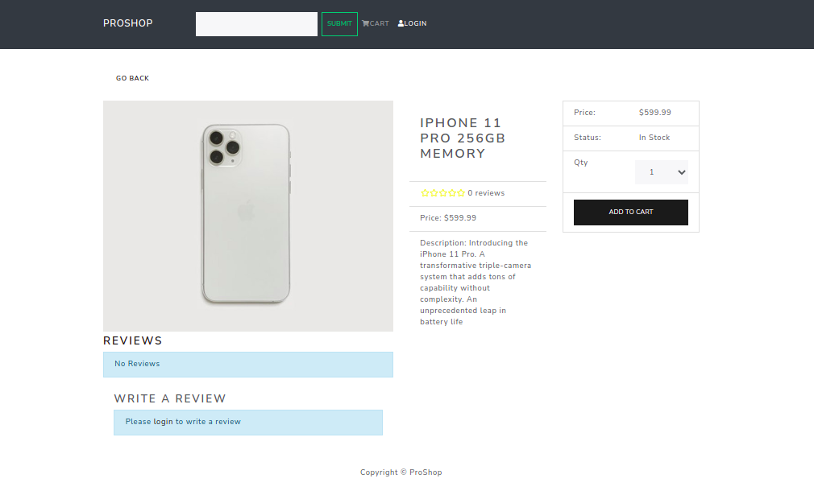

[](https://lbesson.mit-license.org/)

# Proshop
A full-stack ecommerce platform built along with [Dennis Ivys's course](https://www.udemy.com/course/django-with-react-an-ecommerce-website/)

<p align="center">
 <a href="#proshop">About</a> •
 <a href="#features">Features</a> • 
 <a href="#technologies">Technologies</a> • 
 <a href="#getting-started">Getting Started</a> 
</p>




## Features
- CRUD user
- CRUD products
- Admin panel to manage customers, products and orders
- Shopping cart with PayPal and credit/debit payments
- Product rating and review system 

## Technologies
Project built with the following tools:
- Front-end
  - React.js
  - Redux
  - Paypal API
- Back-end
  - Django
  - Django REST framework
  - PostgreSQL

## Getting Started

### Install Back-End Requirements
```sh
$ cd backend
$ mkdir venv && virtualenv -p python3 venv/demo
$ . venv/demo/bin/activate
$ pip install -r requirements.txt
```
### Install Front-End Requirements
```sh
$ cd frontend
$ yarn install
```

### Running application

### Run Back-End
```sh
$ cd backend
$ . venv/demo/bin/activate
$ python manage.py runserver
```
### Run Front-End
```sh
$ cd frontend
$ yarn start
```


